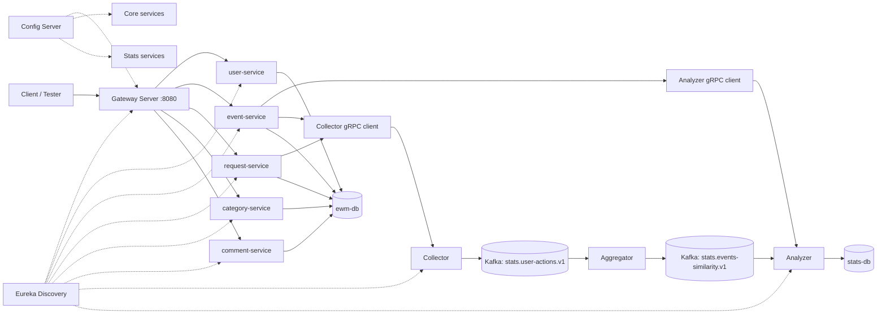

# Explore With Me


**Explore With Me** — микросервисная backend-платформа для публикации событий, поиска мероприятий, заявок на участие, комментариев и персональных рекомендаций.

Проект построен вокруг событийной аналитики: действия пользователей собираются через gRPC, передаются в Kafka, агрегируются и используются для расчёта рейтинга событий и рекомендаций.

---

## Возможности

- Управление пользователями.
- Создание, редактирование, модерация и публикация событий.
- Поиск событий по фильтрам.
- Категории и подборки событий.
- Заявки на участие в событиях.
- Комментарии к событиям.
- Сбор пользовательских действий: `VIEW`, `REGISTER`, `LIKE`.
- Расчёт рейтинга событий на основе взаимодействий.
- Персональные рекомендации для пользователя.
- Расчёт похожих событий.
- Проверка бизнес-правила: лайкать можно только посещённые мероприятия.

---

## Архитектура

Проект разделён на три крупных блока:

### Infra

| Сервис | Назначение |
|---|---|
| `discovery-server` | Service Discovery на базе Eureka |
| `config-server` | Централизованная конфигурация сервисов |
| `gateway-server` | Единая REST-точка входа в систему |

### Core services

| Сервис | Назначение |
|---|---|
| `user-service` | Пользователи и администрирование |
| `category-service` | Категории событий |
| `event-service` | События, подборки, рейтинги и рекомендации |
| `request-service` | Заявки на участие |
| `comment-service` | Комментарии |
| `interaction-api` | Общие DTO, Feign-клиенты и ошибки для core-сервисов |

### Stats services

| Сервис | Назначение |
|---|---|
| `collector` | Принимает действия пользователей через gRPC и публикует их в Kafka |
| `aggregator` | Читает действия пользователей и рассчитывает similarity между событиями |
| `analyzer` | Хранит агрегированные данные и отдаёт рейтинги/рекомендации через gRPC |
| `stats-client` | gRPC-клиенты для core-сервисов |
| `serialization` | Avro и Protobuf схемы |

---

## Схема взаимодействия



---

## Рекомендательная система

Рекомендательная система работает на основе действий пользователей.

| Действие | Вес | Описание |
|---|---:|---|
| `VIEW` | `0.4` | Пользователь просмотрел событие |
| `REGISTER` | `0.8` | Пользователь отправил заявку на участие |
| `LIKE` | `1.0` | Пользователь поставил лайк событию |

Поток данных:

1. `event-service` и `request-service` отправляют действия пользователей в `collector` через gRPC.
2. `collector` публикует события в Kafka topic `stats.user-actions.v1`.
3. `aggregator` читает действия и рассчитывает коэффициенты сходства событий.
4. `aggregator` публикует similarity в Kafka topic `stats.events-similarity.v1`.
5. `analyzer` сохраняет агрегированные данные и отдаёт gRPC API для рейтингов и рекомендаций.
6. `event-service` получает `rating` и рекомендации через `AnalyzerClient`.

---

## API Gateway

Все REST-запросы проходят через Gateway:

```text
http://localhost:8080
```

Основные маршруты:

| Path | Service |
|---|---|
| `/events/**` | `event-service` |
| `/admin/events/**` | `event-service` |
| `/compilations/**` | `event-service` |
| `/admin/compilations/**` | `event-service` |
| `/users/*/requests/**` | `request-service` |
| `/users/*/events/*/requests/**` | `request-service` |
| `/admin/users/**` | `user-service` |
| `/categories/**` | `category-service` |
| `/admin/categories/**` | `category-service` |
| `/comments/**` | `comment-service` |

Примеры endpoint'ов:

```bash
curl -H "X-EWM-USER-ID: 1" \
  http://localhost:8080/events/recommendations
```

```bash
curl -X PUT \
  -H "X-EWM-USER-ID: 1" \
  http://localhost:8080/events/10/like
```

---

## Технологии

- Java 21
- Spring Boot
- Spring Cloud Gateway
- Spring Cloud Config
- Netflix Eureka
- Spring Data JPA
- Spring Web
- Spring Validation
- OpenFeign
- PostgreSQL
- Apache Kafka
- Avro
- Protobuf
- gRPC
- Maven
- Docker Compose
- Lombok

---

## Локальный запуск

### 1. Поднять Docker-инфраструктуру

```bash
docker compose up -d stats-db ewm-db db-init kafka kafka-init-topics
```

Проверить контейнеры:

```bash
docker compose ps
```

Проверить Kafka topics:

```bash
docker exec kafka kafka-topics --bootstrap-server kafka:29092 --list
```

Ожидаемые топики:

```text
stats.user-actions.v1
stats.events-similarity.v1
```

### 2. Запустить infrastructure services

```bash
mvn -pl infra/discovery-server -am spring-boot:run
```

```bash
mvn -pl infra/config-server -am spring-boot:run
```

```bash
mvn -pl infra/gateway-server -am spring-boot:run
```

Eureka UI:

```text
http://localhost:8761
```

Gateway:

```text
http://localhost:8080
```

### 3. Запустить stats services

```bash
mvn -pl stats/collector -am spring-boot:run
```

```bash
mvn -pl stats/aggregator -am spring-boot:run
```

```bash
mvn -pl stats/analyzer -am spring-boot:run
```

### 4. Запустить core services

```bash
mvn -pl core/user-service -am spring-boot:run
```

```bash
mvn -pl core/category-service -am spring-boot:run
```

```bash
mvn -pl core/event-service -am spring-boot:run
```

```bash
mvn -pl core/request-service -am spring-boot:run
```

```bash
mvn -pl core/comment-service -am spring-boot:run
```

---

## Проверка после запуска

Gateway health:

```bash
curl http://localhost:8080/actuator/health
```

Gateway routes:

```bash
curl http://localhost:8080/actuator/gateway/routes
```

Public events:

```bash
curl "http://localhost:8080/events"
```

Recommendations:

```bash
curl -H "X-EWM-USER-ID: 1" \
  "http://localhost:8080/events/recommendations"
```

Get event by id with VIEW action:

```bash
curl -H "X-EWM-USER-ID: 1" \
  "http://localhost:8080/events/1"
```

Like event:

```bash
curl -X PUT \
  -H "X-EWM-USER-ID: 1" \
  "http://localhost:8080/events/1/like" \
  -i
```

---

## Особенности реализации

- Все core-сервисы регистрируются в Eureka и получают конфигурацию из Config Server.
- REST API доступен через Gateway на порту `8080`.
- Внутрисервисные REST-вызовы core-сервисов выполняются через OpenFeign.
- Сбор пользовательских действий выполнен через gRPC.
- Асинхронная аналитика построена на Kafka.
- Для сериализации пользовательских действий используется Avro.
- Для gRPC API используются Protobuf-схемы.
- `LIKE` разрешён только пользователям с подтверждённым участием в событии.

## Статус

Проект реализует микросервисную платформу Explore With Me с интегрированной рекомендательной системой, сбором пользовательских действий, Kafka pipeline и gRPC-взаимодействием между stats и core-сервисами.
